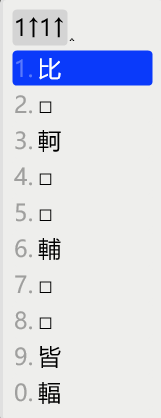
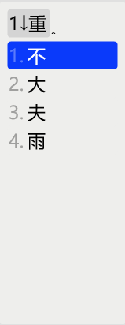

# 行列30

配方： ℞ **array**

[Rime](https://rime.im) [行列30](http://www.array.com.tw/) 輸入方案

## 安裝

[東風破](https://github.com/rime/plum) 安裝口令： `bash rime-install array`

手動安裝： 將`array30*.yaml`和`lua/*.lua`複製到用戶資料夾中並重新部署。

各平台參考安裝步驟請[點此](https://github.com/archerindigo/rime-array/wiki/%E5%AE%89%E8%A3%9D%E6%95%99%E5%AD%B8)。

## 功能說明

以下簡短說明本方案各種實用功能，其他更詳細說明可參考[Wiki](https://github.com/archerindigo/rime-array/wiki)。

### 詞句連書

支援連續輸入多個字之字碼。每字詞之間可以`\`分隔以增加預測準確性。

### 詞彙輸入

預設使用本方案自帶之行列詞庫，符合行列官方詞彙取碼規則（可參考[行列教室](https://www.facebook.com/notes/335303977574152/)最尾部份或[FISH UP行列教學](https://array30.misterfishup.com/tutorial-complete.html#entering-words)）。詞彙以`'`作尾碼。

本方案亦可改用[八股文](https://github.com/rime/rime-essay)自動造詞，惟不支援`'`尾綴，詞彙候選順位可能會因調頻而置於同碼單字之前。啟用方式請參考array30.dict.yaml之附註。

### 符號組

沿用行列官方符號組輸入方式。輸入`w`+`數字`鍵即可選取各符號分組。

> 新功能：輸入`w`+`數字`後可用「空白鍵」翻頁

### Emoji建議

從方案選單 `🈚️->🈶️`選擇啓用Emoji建議功能。啓用後，當輸入字詞時相關意思的emoji將會出現在候選列上。例如輸入`9-9-1v`時候選字`笑`下方將出現`😄`及其他相關笑臉emoji。

此功能乃基於[Rime Emoji / 繪文字輸入方案](https://github.com/rime/rime-emoji/)。

由於此功能會影響候選字順序，請斟酌使用。另外亦可使用下述針對行列30使用環境而設計的Unicode Emoji輸入方案。

### Unicode Emoji輸入方案

此為在原行列30的基礎上新增的emoji輸入方案。用家可透過美式鍵盤大階`A-L`行選取emoji。第一層分類如下：

- `A`: 🙂 表情符號 Smileys & Emotion
- `S`: 🧑 人物及身體 People & Body
- `D`: 🐕 動物及自然界 Animals & Nature
- `F`: 🍴 食物及飲料 Food & Drink
- `G`: ✈ 旅行及地點 Travel & Places
- `H`: ⚽ 活動 Activities
- `J`: 💡 物件Objects
- `K`: 🔣 圖標符號 Symbols
- `L`: 🏴 旗織 Flags

> 新功能：輸入emoji時可用「空白鍵」翻頁

所有emoji由二至三個鍵碼組成。更詳細的取碼原則請參考[Wiki](https://github.com/archerindigo/rime-array/wiki/RIME%E8%A1%8C%E5%88%9730-Emoji-Unicode%E8%BC%B8%E5%85%A5%E6%96%B9%E6%A1%88%E8%AA%AA%E6%98%8E)。

### "?"萬用字元

輸入"?"作為單個萬用字元，支援查找二至四碼字。

### 從其他輸入法反查行列30

以`` ` ``鍵開始輸入[拼音](https://github.com/rime/rime-luna-pinyin)以反查行列碼。

### 簡碼

一、二级簡碼已編排數字鍵位，空碼位以「□」代替。欲上屏簡碼可以透過「數字鍵」來選擇。

 

 ### 特別碼

按下「空白鍵」可自動上屏特別碼，例如：按下`t` + `Space`將上屏「的」。

### 重碼字

按下「空白鍵」上屏文字時，若該碼位只有一個字，則會自動上屏；否則就要用「數字鍵」選擇或者再按一次「空白鍵」。

> 欲輸入「不」，可以透過`z` + `Space` + `1`或`z` + `Space` + `Space`

> 按下`z` + `Space`後馬上開始輸入下個字的字碼會自動上屏「不」

 

## 授權條款

見 [LICENSE](LICENSE)
