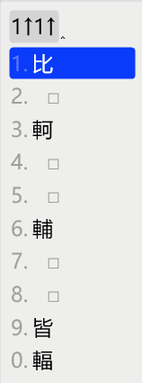
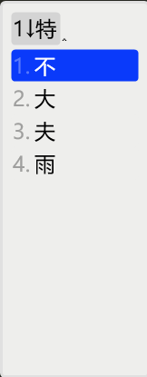

# 行列30

基於`rime-array30`的修改版本。

## What's the difference?

1. 反查字碼
   * 增加萬用字元反查行列碼 *（已merge）*
   * 反查碼以方括弧框住 *（已merge）*
   * 以"="開啟行列反查注音

2. 詞句輸入
   * 去除詞彙字典
   * 取消自動造句功能
   * 沒有候選詞時，按空格清空輸入碼

3. 行列的傳統功能
   * 特別碼不顯示在menu的第一頁
   * 簡碼順序列出，保留空碼位
   * 按下「w + 數字鍵」後可以用「空白鍵」換頁
   * 遇到重碼字時，需要按兩次空白鍵來上屏

## Bug修正

1. 修正萬用字元對於四碼罕字（含'8^'的話共五碼）不生效的問題 *（已merge）*

---

## 功能說明

以下簡短說明本方案各種實用功能，其他更詳細說明可參考[Wiki](https://github.com/archerindigo/rime-array/wiki)。

### 符號組

沿用行列官方符號組輸入方式。輸入`w`+`數字`鍵即可選取各符號分組。

> 新功能：輸入`w`+`數字`後可用「空白鍵」翻頁

### Emoji建議

從方案選單 `🈚️->🈶️`選擇啓用Emoji建議功能。啓用後，當輸入字詞時相關意思的emoji將會出現在候選列上。例如輸入`9-9-1v`時候選字`笑`下方將出現`😄`及其他相關笑臉emoji。

此功能乃基於[Rime Emoji / 繪文字輸入方案](https://github.com/rime/rime-emoji/)。

由於此功能會影響候選字順序，請斟酌使用。另外亦可使用下述針對行列30使用環境而設計的Unicode Emoji輸入方案。

### Unicode Emoji輸入方案

此為在原行列30的基礎上新增的emoji輸入方案。用家可透過美式鍵盤大階`A-L`行選取emoji。第一層分類如下：

- `A`: 🙂 表情符號 Smileys & Emotion
- `S`: 🧑 人物及身體 People & Body
- `D`: 🐕 動物及自然界 Animals & Nature
- `F`: 🍴 食物及飲料 Food & Drink
- `G`: ✈ 旅行及地點 Travel & Places
- `H`: ⚽ 活動 Activities
- `J`: 💡 物件Objects
- `K`: 🔣 圖標符號 Symbols
- `L`: 🏴 旗織 Flags

所有emoji由二至三個鍵碼組成。更詳細的取碼原則請參考[Wiki](https://github.com/archerindigo/rime-array/wiki/RIME%E8%A1%8C%E5%88%9730-Emoji-Unicode%E8%BC%B8%E5%85%A5%E6%96%B9%E6%A1%88%E8%AA%AA%E6%98%8E)。

### "?"萬用字元

輸入"?"作為單個萬用字元，支援查找 ***二至四碼*** 字。

### 從朙月拼音反查行列30

以`` ` ``鍵開始輸入[拼音](https://github.com/rime/rime-luna-pinyin)以反查行列碼。

※欲啟用朙月拼音反查行列碼的功能，需要編譯出`luna_quanpin`的字典文件。`luna_quanpin`輸入方案來自<https://github.com/rime/rime-luna-pinyin>。

### 簡碼

一、二级簡碼已編排數字鍵位，且空碼位會留空，空碼位為「空字串」不會上屏任何文字。欲上屏簡碼可以透過「數字鍵」來選擇。

 

 ### 特別碼

 特別碼的字碼具有「!」後綴，按下「!」可自動上屏特別碼，或者可以按下「空白鍵」來上屏特別碼（「空白鍵」會被轉成「!」）。

 > 欲輸入「的」，可以透過`t` + `!`或者`t` + `Space`。

### 重碼字

「特別碼」和「簡碼」之外的所有中文字碼都有「&」後綴，而拼寫運算會將「&」轉成「!」，目的是把重碼字當作另類的「特別碼」處理。

當按下「空白鍵」時，「空白鍵」會被轉成「!」，如果該碼位只有一個字，則會自動上屏，否則就要用「數字鍵」選擇或者再按一次「空白鍵」。

> 欲輸入「不」，可以透過`z` + `Space` + `1`或`z` + `Space` + `Space`

> 按下`z` + `Space`後馬上開始輸入下個字的字碼會自動上屏「不」

 

## 授權條款

見 [LICENSE](LICENSE)
